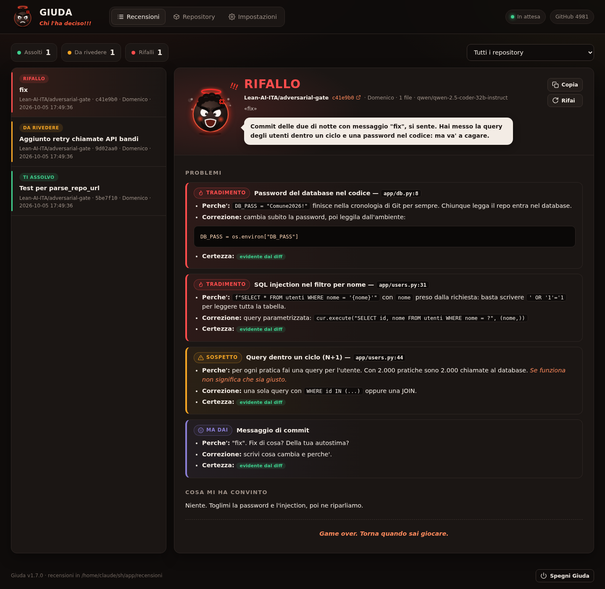
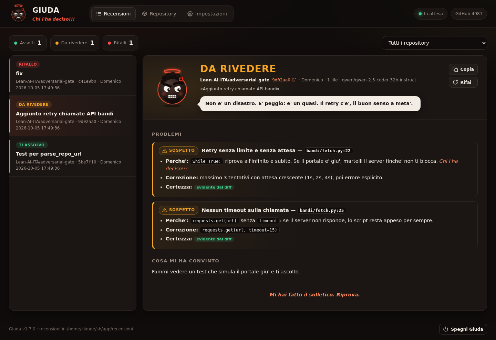
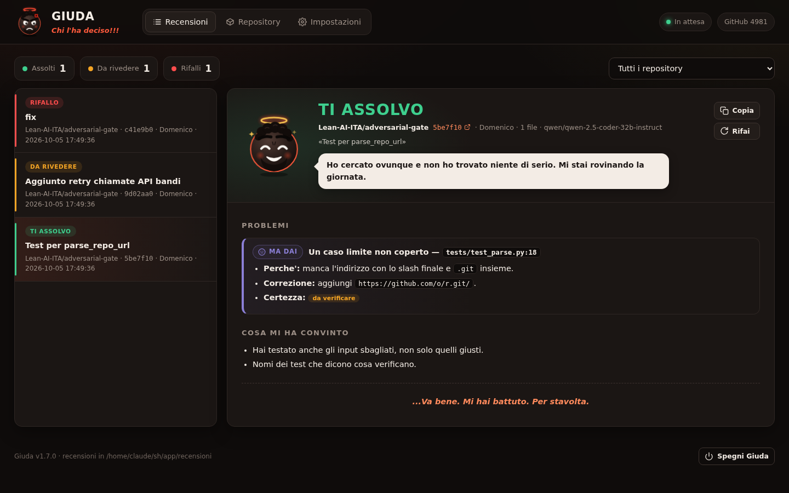
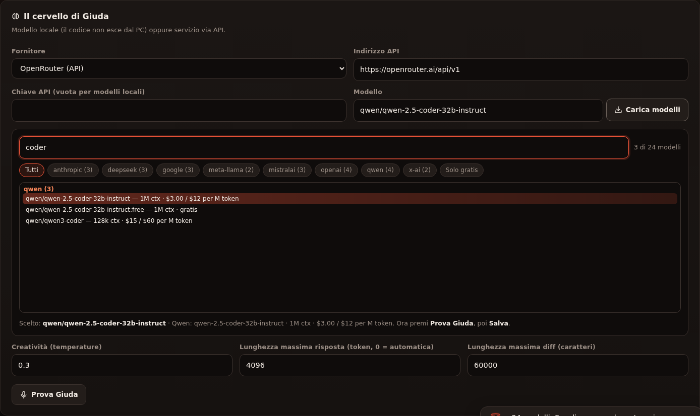

<div align="center">


# Giuda

### Il boss di fine livello del tuo codice

**«Chi l'ha deciso!!!»**

[](https://github.com/Lean-AI-ITA/giuda/actions/workflows/test.yml)


</div>

---

Giuda è un **revisore di codice automatico** che gira sul tuo PC. Gli indichi uno o più repository GitHub: lui li sorveglia e, ogni volta che arriva un nuovo commit, legge il diff e lo giudica con un LLM **locale** (LM Studio, Ollama) o **via API** (OpenAI, Anthropic, OpenRouter, Mistral).

Non è un revisore gentile. Parte dal presupposto che il tuo commit sia sbagliato, è sempre arrabbiato, ti prende in giro e ti manda a quel paese quando trova problemi. **Sorride solo quando lo batti.**

Lo scopo però è serio: mettere alla prova il codice con un avversario che non concede niente. L'umorismo serve a sdrammatizzare e a trasformare la review in una sfida.

<div align="center">

</div>

## Come si presenta



| Da rivedere | Ti assolvo |
|---|---|
|  |  |

> Le recensioni negli screenshot sono esempi scritti a mano per mostrare l'interfaccia. Con un modello vero il testo cambia a ogni commit.

## Cosa fa

- **Sorveglia** i repository GitHub (polling ogni 2 minuti, con ETag per non sprecare richieste; si mette in pausa da solo se il limite di GitHub sta per finire).
- **Giudica ogni nuovo commit**, anche più commit pushati insieme, dal più vecchio al più recente.
- **Salta i file inutili**: lock file, `dist/`, `build/`, file minificati.
- **Scrive la recensione** con problemi ordinati per gravità, file e riga, motivo, correzione e grado di certezza.
- **Emette un verdetto**: `RIFALLO`, `DA RIVEDERE` o `TI ASSOLVO`.
- **Archivia** tutto nell'interfaccia e come file Markdown in `recensioni/`.
- Facoltativamente **pubblica la recensione come commento** sul commit GitHub.

## Avvio rapido

**Windows**

1. Scarica il repository (*Code → Download ZIP*) ed estrailo in una cartella fissa, per esempio `C:\Giuda`.
2. Doppio clic su `INSTALLA_GIUDA.bat`. Se Python manca lo installa, poi crea l'icona *Giuda* sul desktop.
3. Si apre il browser su `http://127.0.0.1:8765`.

**macOS / Linux**

```bash
git clone https://github.com/Lean-AI-ITA/giuda.git
cd giuda
./installa.sh          # oppure semplicemente: python3 giuda.py
```

**Poi, nell'interfaccia:**

1. *Impostazioni* → scegli il fornitore, premi **Carica modelli**, scegli il modello, premi **Prova Giuda**, incolla un token GitHub e salva.
2. *Repository* → incolla l'indirizzo GitHub e premi **Sorveglia**.

La guida completa, passo per passo, è in [`docs/GUIDA.md`](docs/GUIDA.md).

## Come ragiona

Giuda segue una procedura fissa: capisce l'intento del commit, legge il diff riga per riga, passa tutta la checklist, poi fa un **controincrocio**. Per ogni accusa si chiede: *«lo vedo davvero in questa riga?»*. Se la risposta è no, la scarta o la segna come `da verificare`.

| Area | Esempi di controlli |
|---|---|
| Correttezza | casi limite, date e fusi orari, importi, off-by-one |
| Sicurezza (OWASP Top 10) | IDOR, injection, XSS, CSRF, SSRF, JWT, crittografia debole, segreti nel codice, GDPR |
| Chiamate dati | query N+1, paginazione, transazioni, migrazioni distruttive, timeout, retry con backoff, cache |
| Prestazioni | complessità nascosta, I/O bloccante, regex catastrofiche |
| Concorrenza | race condition, deadlock, stato globale |
| Affidabilità | errori inghiottiti, risorse non chiuse, rollback mancanti |
| Osservabilità | log mancanti o con dati sensibili |
| Progettazione | responsabilità mescolate, compatibilità rotta |
| Leggibilità | nomi, funzioni troppo lunghe, commenti che mentono |
| Test | logica nuova senza test, test che non verificano niente |
| Dipendenze e rilascio | versioni non bloccate, container come root, segreti in CI |
| Disciplina del commit | messaggio vago, commit che fa troppe cose insieme |

**Presunzione di colpa, ma niente bugie.** Il verdetto di partenza è `DA RIVEDERE`, e la logica nuova senza test vale sempre almeno un problema medio. Giuda però **non inventa difetti**: se dopo tutta la checklist non trova niente di reale, lo ammette a malincuore.

## Le due personalità

| | Comico (il boss) | Istituzionale |
|---|---|---|
| Tono | Arrabbiato, sarcastico, teatrale | Professionale e asciutto |
| Battute | Sul codice e sul programmatore | Nessuna |
| Parolacce | Una per review, due se `RIFALLO` | Nessuna |
| Rigore | Identico | Identico |

**Limiti fissi della modalità comica:** Giuda ti prende in giro come programmatore, mai sulla persona (aspetto, età, origine, genere, religione, salute, famiglia), e niente insulti pesanti. Il tono è quello delle battute al bar tra colleghi.

### Tormentoni e repertorio

Ogni tormentone è legato a un problema preciso: *«Chi l'ha deciso!!!»* per le scelte non motivate, *«Copy & paste ancora?!»* per le duplicazioni, *«Test? Dove? Ah, giusto… li facciamo domani!»* per la logica senza test.

Oltre ai tormentoni c'è [`repertorio.json`](repertorio.json), con aperture, chiusure, sfottò e sfanculate. A ogni recensione Giuda ne riceve un **campione casuale come esempio di stile**: può usarne al massimo una così com'è, le altre le inventa sul tuo commit. Il file si modifica con un editor di testo e vale dalla recensione successiva, senza riavviare.

### L'avatar


Sempre arrabbiato, peggiora a ogni stato. Sorride solo quando ti assolve.

## Scegliere il modello



**Carica modelli** apre un elenco con ricerca, filtri per fornitore e, per OpenRouter, contesto e prezzi. Su OpenRouter i nomi sono `fornitore/modello` (es. `anthropic/claude-…`, `qwen/…`): vanno lasciati interi.

- **Modelli che ragionano** (molti modelli recenti): imposta *Lunghezza massima risposta* a `0` e *Ragionamento* su **Basso**, altrimenti possono consumare tutti i token pensando e restituire una recensione vuota. Giuda riprova da solo con più token e, se non basta, segnala l'errore con la spiegazione.
- **Modelli locali**: almeno 14B parametri. Sotto, tendono a inventare problemi o a seguire male la checklist.

## Privacy e sicurezza

- Giuda ascolta **solo su `127.0.0.1`**: non è raggiungibile da altri PC. Le richieste da origini esterne vengono rifiutate.
- Con un **modello locale** il codice non lascia il tuo PC. Con un'**API** il diff viene inviato al fornitore: per codice riservato usa un modello locale.
- Chiavi API e token GitHub sono salvati **in chiaro** in `data/config.json`, solo sul tuo PC. Non condividere la cartella `data/`. Usa un token GitHub *fine-grained* con permesso **Contents: Read-only**.
- Per segnalare vulnerabilità vedi [`SECURITY.md`](SECURITY.md).

## Limiti noti

- **Legge solo il diff, non esegue il codice.** Tutto quello che dipende da codice esterno al diff viene segnato `da verificare`.
- **Funziona solo a PC acceso.** Per una sorveglianza continua serve un server sempre attivo (una VPS va benissimo).
- **Senza token GitHub** hai solo 60 richieste l'ora: bastano per poco. L'interfaccia te lo segnala.
- **Il prompt è lungo** (circa 3.000 token): con le API ogni recensione costa qualche centesimo in più, di più con i modelli che ragionano.
- I modelli via API possono **ammorbidire il tono** di loro iniziativa.

## Struttura

```
giuda/
├── giuda.py               # motore: polling GitHub, prompt, LLM, server web
├── web/index.html         # interfaccia e avatar animato (SVG)
├── repertorio.json        # le frasi di Giuda
├── INSTALLA_GIUDA.bat     # installazione Windows
├── AVVIA_GIUDA.bat        # avvio Windows
├── DISINSTALLA_GIUDA.bat  # rimozione Windows
├── installa.sh            # installazione macOS / Linux
├── tests/                 # test (solo libreria standard)
└── docs/                  # guida e immagini
```

Dati creati al primo avvio (esclusi da Git): `data/` per configurazione, database e log, `recensioni/` per le recensioni in Markdown.

## Test

```bash
python -m unittest discover -s tests -v
```

I test non chiamano servizi esterni: usano un finto GitHub e un finto LLM in locale. Girano a ogni push con GitHub Actions su Python 3.9 e 3.12, su Linux e Windows.

## Contribuire

Le PR sono benvenute, soprattutto **frasi nuove per il repertorio**. Vedi [`CONTRIBUTING.md`](CONTRIBUTING.md). Ogni PR viene giudicata come merita.

## Progetti collegati

- [**adversarial-gate**](https://github.com/Lean-AI-ITA/adversarial-gate): gate di pianificazione con contraddittorio strutturato per Claude Code. Giuda fa la stessa cosa **dopo**, sul codice prodotto.

## Licenza

[MIT](LICENSE) © 2026 Lean-AI-ITA

<div align="center"><br><i>«Un buon amico ti dice la verità. Giuda te la grida.»</i></div>
